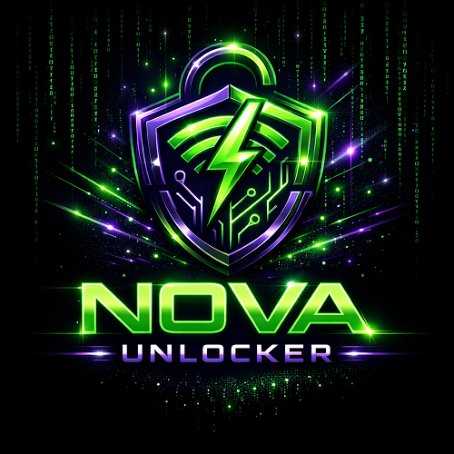
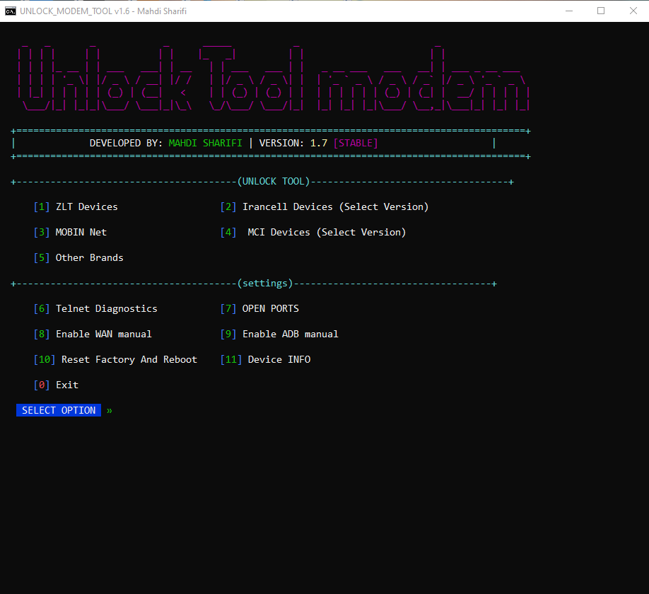

# 🔓 UNLOCK MODEM TOOL

### Professional LTE Modem Service Platform

  <b>Windows App</b> · <b>License Access</b> · <b>Supported Modem Families</b> · <b>Telegram Support</b>

  
  
  

---

## معرفی پروژه

**UNLOCK MODEM TOOL** یک پلتفرم حرفه‌ای ویندوزی برای سرویس، مدیریت و آنلاک مودم‌های پشتیبانی‌شده است.  
این پروژه با هدف ارائه یک محیط تمیز، سریع و قابل‌اعتماد برای کاربران و تکنسین‌ها طراحی شده است.

### 📢 اخبار انتشار، آموزش‌ها و پشتیبانی در تلگرام

---

## قابلیت‌ها

| بخش | وضعیت |
|---|---|
| رابط کاربری حرفه‌ای ویندوز | آماده |
| سیستم لایسنس و کنترل دسترسی | آماده |
| بررسی نسخه و وضعیت سرور | آماده |
| منوی دستگاه‌های پشتیبانی‌شده | آماده |
| پشتیبانی و اطلاع‌رسانی تلگرام | فعال |
| انتشار عمومی اپلیکیشن | به‌زودی |

---

## دستگاه‌ها و خانواده‌های هدف

پشتیبانی نهایی به مدل، فریمور، منطقه و وضعیت دستگاه بستگی دارد.

- ZLT Series
- Irancell LTE CPE
- Huawei LTE CPE
- ZTE LTE / MiFi
- OpenWRT related tools
- More models soon

---

## Preview

&nbsp;

---

## Release Status

نسخه عمومی اپلیکیشن بعد از تست نهایی منتشر می‌شود.  
برای دریافت خبر انتشار، وارد تلگرام شوید.

---

## Responsible Use

This project is intended for supported devices that the user owns or is authorized to service.  
Users are responsible for following local laws, operator terms, firmware safety requirements, and warranty conditions.

---

**UNLOCK MODEM TOOL**  
Professional modem service platform

