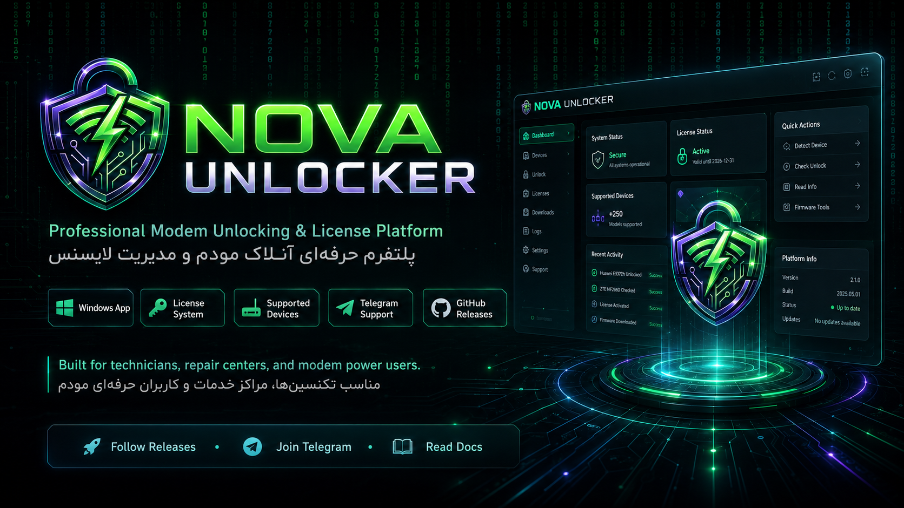
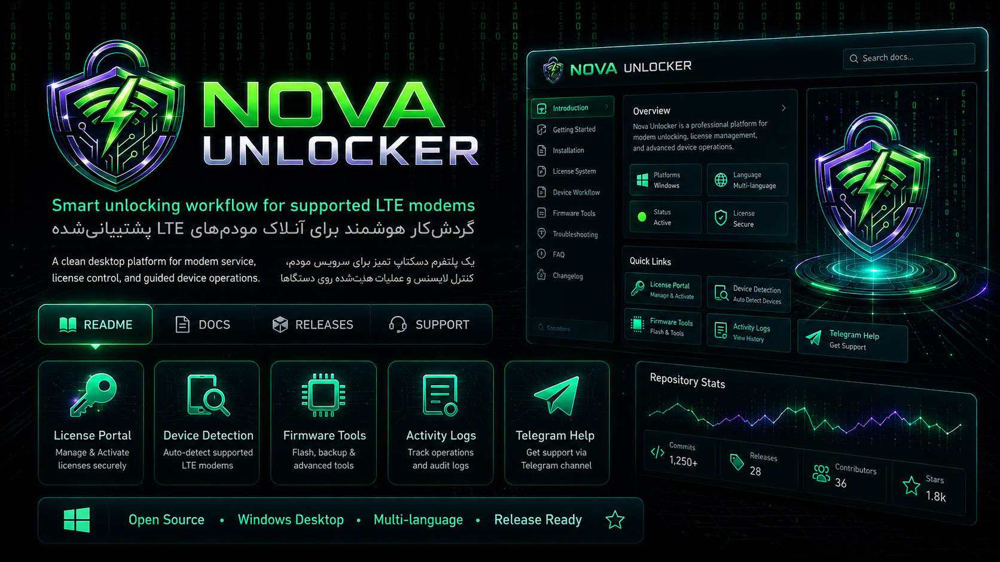
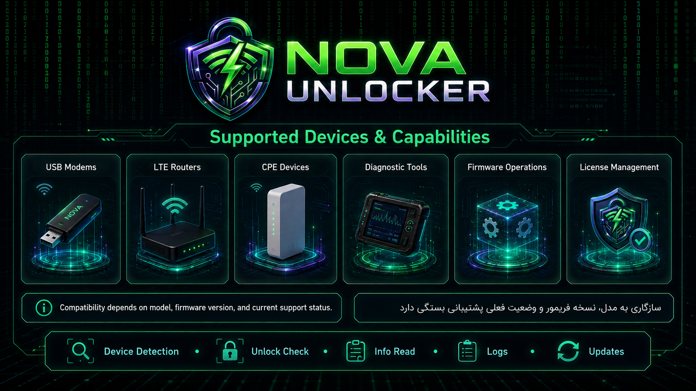
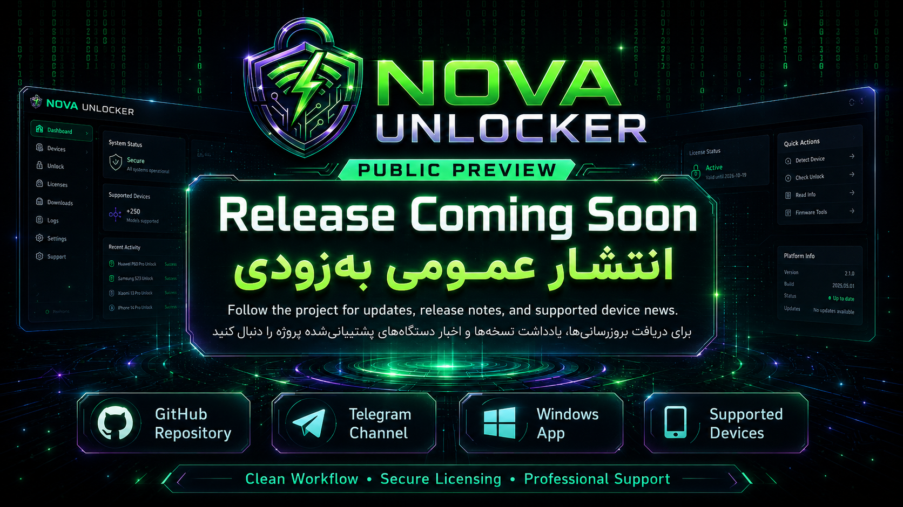

# ⚡ NOVA Unlocker

### Professional Modem Unlocking & License Platform  
### پلتفرم حرفه‌ای آنلاک مودم و مدیریت لایسنس

  
  
  
  

---

## 🌍 Language / زبان

- [English](#english)
- [فارسی](#فارسی)
- [Türkçe](#türkçe)
- [العربية](#العربية)

---

## English

**NOVA Unlocker** is a professional Windows desktop platform for modem service workflows, license control, device detection, firmware-related utilities, activity logs, and guided operations for supported LTE modem families.

This repository is the public project hub for previews, release announcements, documentation, supported-device news, and community updates.

### Key Highlights

| Area | Status |
|---|---|
| Windows desktop application | Public preview |
| License and access control | Ready |
| Device detection workflow | Ready |
| Supported modem families | Expanding |
| Telegram support channel | Active |
| Public release package | Coming soon |

### Built For

- Technicians
- Repair centers
- Modem service providers
- Advanced modem users
- Support teams

---

## فارسی

**نوا آنلاکر** یک پلتفرم دسکتاپ حرفه‌ای برای سرویس مودم، مدیریت لایسنس، تشخیص دستگاه، ابزارهای مرتبط با فریمور، گزارش فعالیت‌ها و عملیات هدایت‌شده روی مودم‌های پشتیبانی‌شده است.

این ریپازیتوری برای معرفی عمومی پروژه، نمایش پیش‌نمایش‌ها، اعلام اخبار انتشار، مستندات و هدایت کاربران به تلگرام آماده شده است.

### قابلیت‌های اصلی

| بخش | وضعیت |
|---|---|
| اپلیکیشن ویندوزی | پیش‌نمایش عمومی |
| سیستم لایسنس و دسترسی | آماده |
| تشخیص دستگاه | آماده |
| خانواده‌های مودم پشتیبانی‌شده | در حال گسترش |
| کانال تلگرام پشتیبانی | فعال |
| نسخه عمومی نهایی | به‌زودی |

### مناسب برای

- تکنسین‌ها
- مراکز خدمات و تعمیرات
- سرویس‌کارهای مودم
- کاربران حرفه‌ای مودم
- تیم‌های پشتیبانی

---

## Türkçe

**NOVA Unlocker**, desteklenen LTE modem aileleri için Windows tabanlı profesyonel bir modem servis, lisans yönetimi, cihaz algılama ve işlem akışı platformudur.

Bu depo; proje tanıtımı, önizlemeler, yayın duyuruları, dokümantasyon ve Telegram destek akışı için hazırlanmıştır.

### Özellikler

| Bölüm | Durum |
|---|---|
| Windows masaüstü uygulaması | Public preview |
| Lisans sistemi | Hazır |
| Cihaz algılama | Hazır |
| Desteklenen modem aileleri | Genişletiliyor |
| Telegram destek kanalı | Aktif |
| Genel yayın paketi | Yakında |

---

## العربية

**NOVA Unlocker** هو مشروع احترافي لسطح مكتب Windows يهدف إلى تنظيم عمليات خدمة المودمات المدعومة، إدارة التراخيص، اكتشاف الأجهزة، أدوات الفيرموير، وسجلات النشاط.

هذا المستودع مخصص للتعريف بالمشروع، عرض الصور، أخبار الإصدارات، والتحديثات عبر Telegram.

---

## 🖼️ Project Preview

### Dashboard & Documentation View

### Supported Devices & Capabilities

### Public Preview Announcement

---

## 🧩 Supported Device Areas

> Compatibility depends on model, firmware version, region, and current support status.  
> سازگاری به مدل، نسخه فریمور، منطقه و وضعیت فعلی پشتیبانی بستگی دارد.

| Category | Description |
|---|---|
| USB Modems | Supported USB LTE modem workflows |
| LTE Routers | Router and CPE related service flow |
| CPE Devices | Customer-premises LTE devices |
| Diagnostic Tools | Device detection, info reading, logs |
| Firmware Operations | Firmware-related service utilities |
| License Management | Secure license activation and access control |

---

## 📢 Updates & Support

### Join Telegram for release news, device updates, and support

---

## 🛡️ Responsible Use

This project is intended for supported devices that the user owns or is authorized to service.  
Users are responsible for local laws, operator terms, warranty conditions, and safe firmware practices.

این ابزار فقط برای دستگاه‌هایی است که مالک آن هستید یا اجازه سرویس آن را دارید. رعایت قوانین، شرایط اپراتور، گارانتی و ایمنی فریمور بر عهده کاربر است.

---

**NOVA Unlocker**  
Clean Workflow • Secure Licensing • Professional Support

